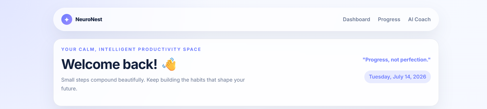
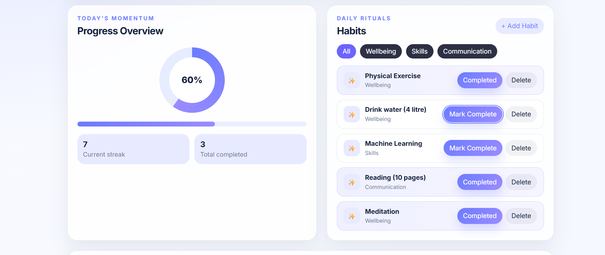
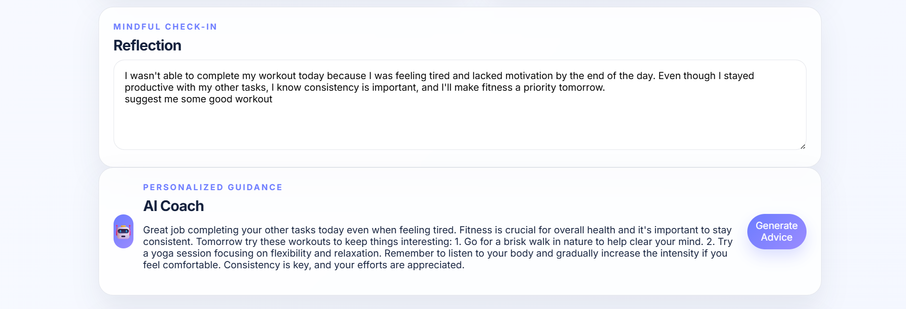
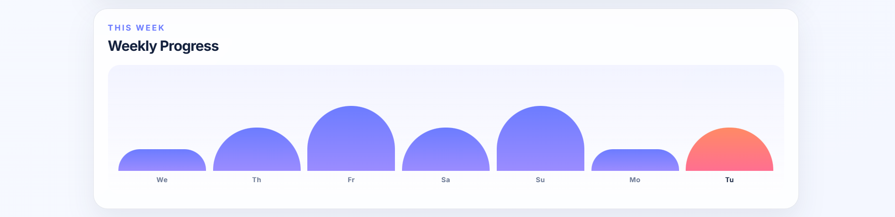
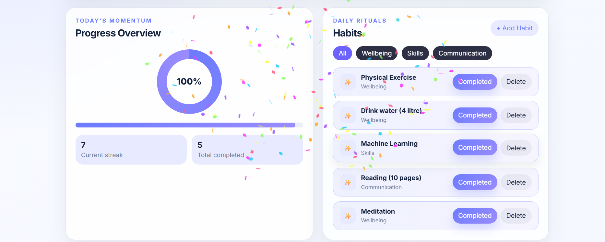

# 🧠 NeuroNest

**NeuroNest** is an offline AI-powered habit tracking and productivity companion that helps users build consistent routines through intelligent coaching, daily reflections, and progress tracking. By running the AI model locally, NeuroNest ensures privacy, works without an internet connection, and provides personalized guidance entirely on-device.

---

# 📌 Problem

Many productivity and habit-tracking applications rely on cloud-based AI services to provide personalized recommendations. While effective, these solutions introduce several challenges:

- Internet connectivity is required for AI features.
- Personal reflections and habit data are sent to external servers, raising privacy concerns.
- Cloud AI services often require paid subscriptions.
- Users in low-connectivity environments cannot access intelligent assistance reliably.

There is a need for an intelligent productivity companion that delivers personalized guidance while keeping user data completely private.

---

# 💡 Solution

NeuroNest addresses these challenges by combining habit tracking with an offline AI coach.

The application allows users to:

- 📅 Create and manage daily habits
- ✅ Track daily progress
- 📝 Record personal reflections
- 🤖 Receive personalized AI-generated coaching
- 📊 Visualize daily productivity
- 🎉 Celebrate completed goals with interactive feedback
- 💡 Stay motivated with daily inspirational quotes
- 🔍 Filter habits by category for better organization

Since all AI inference runs locally, users can continue using the application even without an internet connection while maintaining complete control over their personal data.

---

# 🤖 On-Device AI Usage

## What runs locally?

NeuroNest performs the following tasks entirely on-device:

- Reflection analysis
- Personalized habit coaching
- AI response generation

No reflection or habit data is transmitted to any external service.

## AI Runtime

- **llama.cpp**

## AI Model

- **Qwen2.5-3B-Instruct (GGUF)**

## Execution

- CPU-based local inference
- No cloud APIs
- No internet required for AI features

---

# 🔒 Privacy

NeuroNest follows a privacy-first approach.

- All habit data is stored locally using SQLite.
- AI inference is performed entirely on-device.
- No user reflections are uploaded to external servers.
- The application remains functional even without an internet connection.

---

# ✨ Features

- 🤖 Offline AI Coach
- 📅 Daily Habit Tracker
- 📊 Progress Dashboard
- 📝 Reflection Journal
- 🎉 Confetti celebration after completing all habits
- 💡 Daily motivational quotes
- 🔍 Habit filtering by category
- ⚡ Responsive React interface
- 💾 Local SQLite storage

---

# 🛠 Tech Stack

## Frontend

- React
- Vite
- JavaScript
- CSS

## Backend

- Flask
- Python
- SQLite

## AI

- llama.cpp
- GGUF Language Models
- Qwen2.5-3B-Instruct

## Tools

- Git
- GitHub
- VS Code

---

# ⚙ Setup and Usage

## Clone the repository

```bash
git clone https://github.com/keshavkumbhaj/NeuroNest-
cd NeuroNest-
```

---

## Backend Setup

Navigate to the backend directory:

```bash
cd Backend
```

Install dependencies:

```bash
pip install -r requirements.txt

If you don't already have the Qwen2.5-3B GGUF model, download it and place it inside:

Backend/models_gguf/
```

Create a `.env` file:

```env
MODEL_FILENAME=qwen2.5-3b-instruct.Q4_K_M.gguf
```

Place your GGUF model inside:

```
Backend/models_gguf/
```

Run the Flask server:

```bash
python app.py
```

---

## Frontend Setup

Open a new terminal:

```bash
cd neuronest-react
```

Install dependencies:

```bash
npm install
```

Run the development server:

```bash
npm run dev
```

Visit:

```
http://localhost:5173
```

---

# 📂 Project Structure

NeuroNest
│
├── Backend
│   ├── app.py
│   ├── routes.py
│   ├── ai_engine.py
│   ├── config.py
│   ├── database.py
│   ├── models.py
│   ├── requirements.txt
│   ├── models_gguf/
│   │   └── qwen2.5-3b-instruct.Q4_K_M.gguf
│   └── llama.cpp/
│
├── neuronest-react
│   ├── src/
│   ├── public/
│   ├── package.json
│   └── ...
│
├── screenshots/
│   ├── dashboard.png
│   ├── ai-coach.png
│   ├── habits.png
│   ├── progress.png
│   └── reflection.png
│
├── README.md
├── ARCHITECTURE.md
├── TECHNICAL_REPORT.md
├── PRIVACY.md
├── ATTRIBUTION.md
└── LICENSE

# 📸 Demo and Screenshots

## Demo Video

## 🎥 Demo Video

Watch the demo here:
https://youtu.be/1R99hM6Trjk

## Screenshots

### Dashboard



### Habit Management



### AI Coach



### Weekly Progress



### Completed Habits



---

# 🚀 Future Improvements

- Weekly and monthly analytics
- User authentication
- Cloud synchronization (optional)
- Mobile application
- Multiple offline AI model support
- Personalized AI habit planning

---

# 👥 Team

**Keshav Sharma**  
- Frontend Development
- Backend Development
- AI Integration

**Ankit Singh Mahara**
- Research and Development 
- Model Testing and Validation
- Feature Evaluation and Feedback


---

# 📄 License

This project is licensed under the **MIT License**.